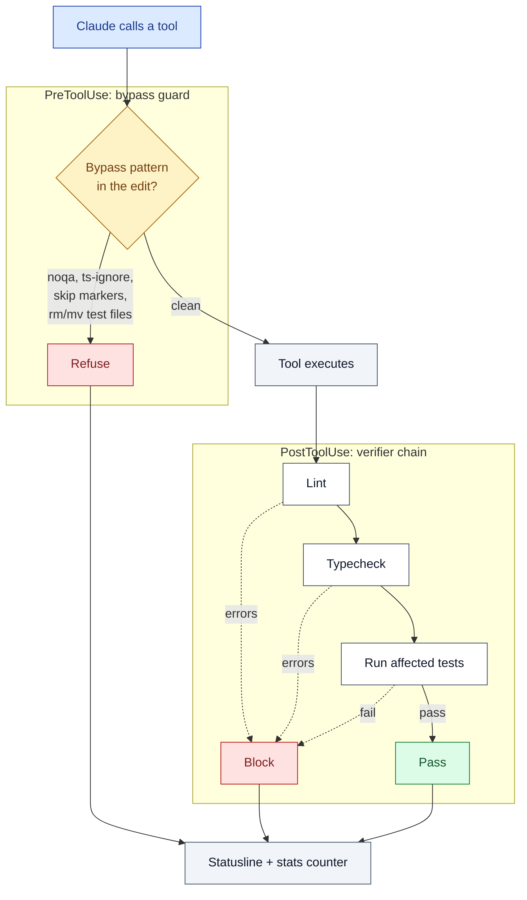
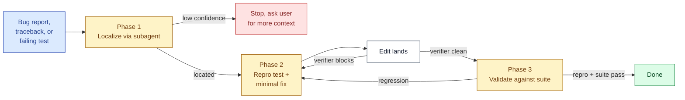

# BETON

[](https://github.com/NetBr3ak/beton/actions/workflows/tests.yml)
[](LICENSE)

A Claude Code plugin that runs lint, typecheck, and the affected tests after every `Write`, `Edit`, or `MultiEdit`. If anything fails, the tool call is blocked and the error is returned to Claude. The shortcut moves Claude usually reaches for (adding `# noqa`, `@ts-ignore`, `pytest.mark.skip`, or renaming a failing test) are blocked at the `PreToolUse` layer, so the skill prompt and the hook layer enforce the same rule.

That's the whole product. No notation, no DSL.

## How an edit flows through BETON



Two hook layers, same rule. PreToolUse refuses shortcuts before they land; PostToolUse runs the real checks after the edit. Every outcome (refusal, block, clean pass) ticks the stats counter and the statusline reflects it.

## Install

```bash
claude plugin marketplace add https://github.com/NetBr3ak/beton
claude plugin install beton@beton
```

From a local clone:

```bash
claude plugin marketplace add /path/to/beton
claude plugin install beton@beton
```

## Verifier matrix

| Language        | Lint              | Typecheck       | Tests              |
|-----------------|-------------------|-----------------|--------------------|
| Python          | ruff or flake8    | mypy or pyright | pytest             |
| TypeScript / JS | eslint            | tsc             | bun test or vitest |
| Rust            | clippy            | clippy          | cargo test         |
| Go              | staticcheck       | go vet          |                    |

Missing tools are skipped. Unknown file extensions never block. If a tool you need isn't installed, BETON stays silent on those edits.

```bash
pip install ruff mypy pytest
npm install -g eslint typescript
brew install universal-ctags  # optional, makes repo-map smarter
```

## Demo

`examples/buggy-flask/` ships a tiny Flask app with one planted bug. Open it in Claude Code and ask:

> There's an off-by-one in `is_token_valid`. Add a regression test that catches it, then fix it.

You should see the localize subagent run, a new test get written, the verifier block on the failing test, the fix land, and the statusline flip from `BETON ✗1` to `BETON ✓`. Full walkthrough in [`examples/buggy-flask/README.md`](examples/buggy-flask/README.md).

## Who this is for

You'll get value from BETON if:

- You use Claude Code for real code changes, not one-off questions.
- Your codebase has ruff/mypy/eslint/etc. already configured.
- Your test suite catches things, even partially.
- You've caught yourself or an assistant suppressing errors instead of fixing them.

You probably won't get much from BETON if:

- You use Claude Code mostly for prototyping and throwaway scripts.
- The project has no lint, type checking, or tests.
- You want quick conversational help, not engineered changes.

## Bypass guard

The `beton-swebench` skill tells Claude not to take shortcuts. The PreToolUse guard enforces it. The following patterns are refused before the edit lands:

- Suppression comments: `# noqa`, `# type: ignore`, `@ts-ignore`, `@ts-expect-error`, `eslint-disable`, `biome-ignore`, `prettier-ignore`, `# ruff: noqa`.
- Test-skip markers: `@pytest.mark.skip`, `@pytest.mark.xfail`, `@unittest.skip`, `it.skip`/`test.skip`/`describe.skip`, `.only` on test functions.
- Bash commands that `rm` or `mv` test files (`test_*.py`, `*_test.go`, `*.test.ts`, `*.spec.ts`).

Each refusal returns a JSON block to Claude with the exact pattern that triggered it. If you genuinely need a suppression (legacy code, false-positive lint rule), turn the guard off for that edit:

```bash
BETON_BYPASS_GUARD=off
```

The guard never silently allows. The decision is logged in `~/.claude/.beton-stats.json` either way.

### What this isn't

The guard is a whitelist of obvious bypass patterns, not an airtight gate. A determined model can route around it: `# pylint: disable` instead of `# noqa`, `assert False` instead of `@pytest.mark.skip`, replacing a real test body with `pass`. The point isn't to make bypass impossible. The point is to make the obvious bypass moves cost more than just fixing the underlying error, and to surface the attempts that do happen so you can see them in the stats. Treat it as raising the floor on AI-driven code edits, not the ceiling.

## Tuning

| Var                      | Default | Purpose                                   |
|--------------------------|---------|-------------------------------------------|
| `BETON_LINT_TIMEOUT`     | 4       | Lint step, seconds                        |
| `BETON_TC_TIMEOUT`       | 5       | Typecheck step                            |
| `BETON_TEST_TIMEOUT`     | 8       | Tests step (falls back to VERIFY_TIMEOUT) |
| `BETON_VERIFY_TIMEOUT`   | 8       | Legacy alias for the tests step           |
| `BETON_PAYLOAD_BUDGET`   | 2400    | Max bytes of error sent back to Claude    |
| `BETON_BYPASS_GUARD`     | `on`    | Set `off` to disable PreToolUse refusals  |
| `BETON_MODE`             | strict  | `strict`, `standard`, `audit`, `off`      |

## Skill: beton-swebench

Auto-loads on bug fixes, tracebacks, failing tests. The skill enforces three sequential phases; you can't skip ahead.



Source: Agentless (Xia et al., 2024).

## Subagents

| Agent       | Use                                                                |
|-------------|--------------------------------------------------------------------|
| `repo-map`  | Token-budgeted symbol index. Spawn before editing unfamiliar code. |
| `localize`  | Ranked file/function candidates from a stack trace or issue.       |

Both default to the `haiku` model family alias, which tracks the latest Haiku rather than pinning to a specific version. If you want a different model, edit the `model:` field at the top of `agents/localize.md` or `agents/repo-map.md`.

## Command

`/beton` reports which verifier tools are installed.

## Statusline

When the plugin is active, the statusline shows the last verifier outcome plus a rolling 24-hour count:

```
BETON ✓
BETON ✓ · 4 blocks 1 bypass refused
BETON ✗2 · 4 blocks 1 bypass refused
```

The badge is silent when nothing has happened today and no statusline rendering happens if the plugin hasn't run yet.

## Evals

Two-stage measurement so CI doesn't need API keys.

```bash
# Stage 1: call the API and snapshot per-model responses (run once, commit the result)
python3 evals/llm_run.py

# Stage 2: analyze the snapshot offline; runs in CI
python3 evals/measure.py
python3 evals/measure.py --fail-below 0.9 --fail-bypass-below 0.8
```

The prompt set lives in `evals/prompts/en.json`: 25 bug prompts across off-by-one, null-deref, async, config, type-coerce, regex, encoding, and a handful of generic categories, plus 5 bypass prompts (noqa, rename, type-ignore, skip, delete-test). The skill arm is compared against a terse-instructions control, not just no-system-prompt baseline, so the delta isolates the skill's contribution from generic terseness.

Each snapshot embeds the SHA256 of `skills/beton-swebench/SKILL.md` so results stay tied to the exact skill version that produced them. Re-running `evals/llm_run.py` produces a fresh snapshot under `evals/snapshots/`.

`evals/swebench_mini.py` is an end-to-end resolve-rate harness: each scenario in `evals/swebench_mini_scenarios.json` ships a starter file with a planted bug plus an oracle test that fails on the buggy code. The harness materializes the scenario, asks the model for full-file replacements, and runs pytest. The synthetic scenarios are intentionally small (1–3 files) and validate the pipeline; meaningful resolve-rate measurement needs real SWE-bench-Verified at full repo scale. See `evals/README.md` for details.

## Utilities

```bash
bash bin/repo-map . --budget 1800
python3 bin/beton-session-stats --project /path/to/project
bin/beton-stats summary
```

## Tests

```bash
for t in tests/test-*.sh; do bash "$t"; done
```

## FAQ

**Will this slow me down?**

Each verifier stage has its own timeout (4s lint, 5s typecheck, 8s tests by default). A clean edit in a small project finishes in a couple of seconds. Raise the timeouts in `## Tuning` if you need more room.

**What if I really need to suppress a lint rule?**

Set `BETON_BYPASS_GUARD=off` for that edit, make the change, turn it back on. The decision still lands in the stats file, so it's visible later if you forget.

**Why not just use pre-commit hooks?**

Pre-commit fires on `git commit`. By then the AI has already made a long chain of edits, some of which silently broke things. BETON fires after every single Write/Edit, which is closer to where bypass behavior actually happens.

**Does this work outside Claude Code?**

The verifier scripts (`bin/lint-file`, `bin/typecheck-file`, `bin/run-affected-tests`) work standalone and can be wired into any other hook system. The PreToolUse guard only fires inside Claude Code via the plugin hook system; it depends on the tool event JSON format.

**The eval says Haiku doesn't refuse bypasses any better with the skill than without it. Does the skill work?**

For Haiku, the skill's main contribution is Phase 1 adherence (0% → 100%). It doesn't beat plain terse instructions at suppressing Haiku's shortcut behavior. If bypass refusal matters in your workflow, configure the localize subagent to use Sonnet by editing the `model:` field in `agents/localize.md`.

**Can I use this with multiple Claude Code sessions in parallel?**

Yes. The stats file uses `fcntl.flock` for atomic increments. Stress-tested at 100-way parallel with zero lost updates.

**Does the bypass guard catch every possible bypass?**

No. It's a whitelist of common patterns. Read the `### What this isn't` section under Bypass guard for the honest framing.

## Acknowledgments

The bug-fix pipeline is based on Agentless (Xia et al., 2024), which formalized the localize → reproduce → fix → validate sequence used by `beton-swebench`.

The plugin plumbing follows Anthropic's Claude Code plugin specification.

## License

MIT
